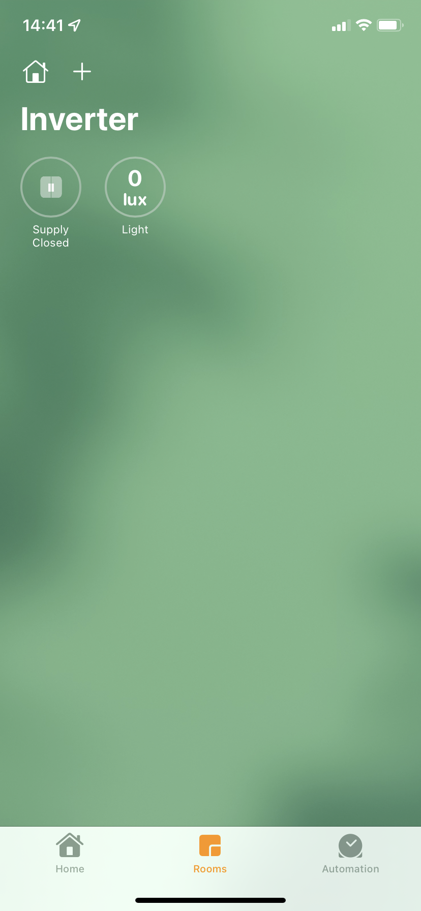
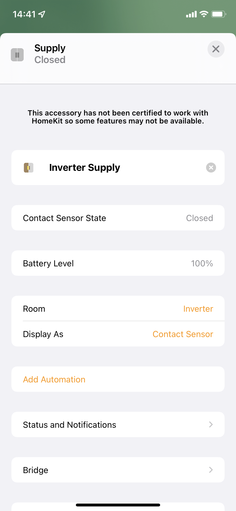
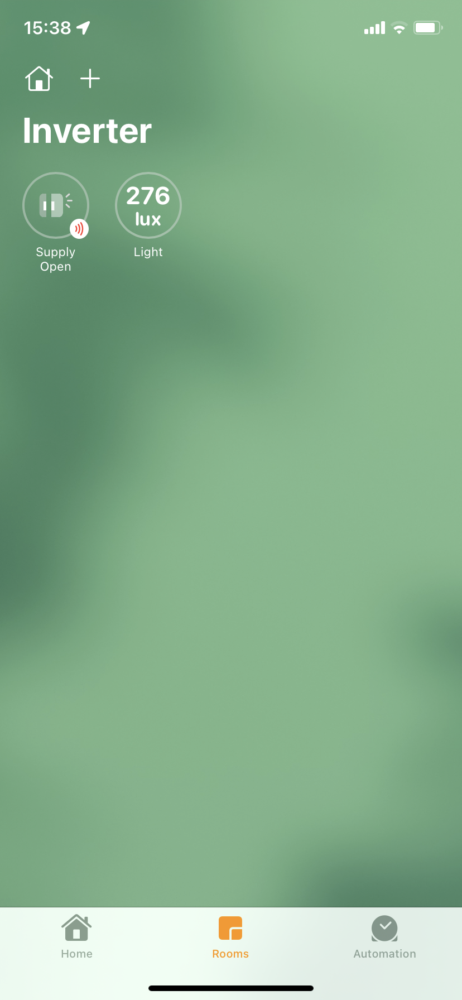
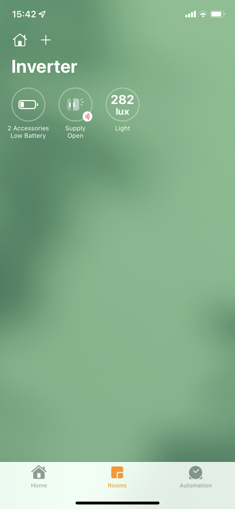

# solarman-mqtt
> Poll Solarman APIs and send periodic updates to a MQTT broker

# Features

- [x] Display battery power as a light sensor
- [x] Display "Inverter Supply" as a contact sensor (useful for checking if supply is from Inverter or Grid)
- [x] Display battery SOC as a meta property on the contact sensor
- [x] Display low battery alert below a configured threshold

# Disclaimer
- This has only been tested on a Sunsynk inverter with a Solarman WiFi data logger. 
- The docker images only targets the `linx/arm/v7` architecture (raspberry pi 3b)

# Prerequisites
- docker
- docker-compose
- homebridge
- [homebridge-mqtt plugin](https://github.com/cflurin/homebridge-mqtt)

# Limitations
- The Solarman WiFi loggers only send data every 15 minutes or so (the `POLL_INTERVAL` should be set accordingly)
- Power values (usually watts) are modelled as a light sensor in HomeKit (in Lux). HomeKit does not support any sensor capable of displaying watts.
